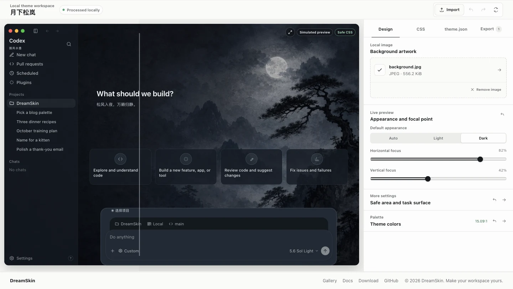

# Codex Dream Skin — Personal Windows Downstream

[中文](./README.md) · [Upstream](https://github.com/Fei-Away/Codex-Dream-Skin) · [Windows guide](./windows/README.en.md)

This repository is a personal Windows-focused downstream of [`Fei-Away/Codex-Dream-Skin`](https://github.com/Fei-Away/Codex-Dream-Skin), currently synchronized with upstream **v1.5.11**. It is maintained for a custom workflow and is not intended for an upstream pull request. It is not affiliated with OpenAI.

## Downstream differences

- One `Codex 梦境皮肤` shortcut launches/reapplies the skin and ensures the tray manager is running.
- Full restore remains inside the tray menu; separate restore and tray shortcuts are unnecessary.
- Each saved theme stores its own Codex task/conversation background strength from 0 to 100.
- The slider previews after roughly 200 ms; OK persists the value and Cancel restores the exact previous value.
- Task strength affects Codex task/conversation routes only. Home screens are unchanged.
- Switching a saved theme automatically restarts a stopped skin session.
- Upstream v1.5.11 content fingerprinting, ZIP validation, Safe CSS checks, hot switching, and rollback remain intact.

## Requirements

- Windows 10/11 x64.
- The official Microsoft Store `OpenAI.Codex` / ChatGPT desktop package, launched at least once.
- Exit Codex and the Dream Skin tray before installing or updating.
- Node.js 22+ for source installation; Node.js 22 is used in the current verification.

## Install from this repository

This personal repository does not currently publish its own release binaries. Use the source installer; upstream Setup binaries do not include the downstream task-strength feature.

The v1.5.11 baseline recognizes the Codex 26.727 main surface, header, top fade, and Settings renderer, fixing cases where the injector was running but task pages were not skinned correctly.

```powershell
git clone https://github.com/angle1592/Codex-Dream-Skin.git
cd .\Codex-Dream-Skin
powershell.exe -NoProfile -ExecutionPolicy RemoteSigned -File .\windows\scripts\install-dream-skin.ps1
```

Launch **Codex 梦境皮肤**, then right-click the `Codex Dream Skin` tray icon to change backgrounds, import ZIP themes, save/switch themes, adjust task-page strength, pause, update, or fully restore Codex.

Strength meanings: `0` prioritizes readability and hides the task background, `55` is the default balance, and `100` shows the artwork most clearly while retaining a minimum text-protection veil. Values are stored as `art.taskBackgroundStrength` in each theme.

## Update

Exit Codex and the tray, then run:

```powershell
git pull --ff-only
powershell.exe -NoProfile -ExecutionPolicy RemoteSigned -File .\windows\scripts\install-dream-skin.ps1
```

The managed runtime under `%LOCALAPPDATA%\CodexDreamSkin\engine` is replaced, while active/saved themes and imported images are preserved.

## Verify

```powershell
node .\tools\sync-runtime-assets.mjs
powershell.exe -NoProfile -File .\windows\tests\run-tests.ps1
```

Logs live under `%LOCALAPPDATA%\CodexDreamSkin`. Do not take ownership of WindowsApps or modify the official app package when troubleshooting.

## Credits and license

<p align="center">
  <a href="https://dreamskin.cc/studio">
    
  </a><br>
  <sub>Online Studio · live preview on the left, background artwork, appearance/focal point, and palette on the right; any library theme loads straight in to keep editing</sub>
</p>

The macOS menu bar and Windows tray both link straight to **Gallery** and
**Online Studio**.

### One-click apply

Found a theme you like on DreamSkin.cc? **Apply** hands it to the local client
directly — no download-then-import step. Requires client v1.5.0 or newer
(v1.5.5+ recommended).

Flow and safety boundary:

- The page invokes the local app through `dreamskin://apply?version=ver_...`.
  The link can carry exactly one theme version ID — **never** an arbitrary URL,
  file path, or command — and there is no silent-apply parameter.
- The app fetches the package only from the fixed official API, and refuses
  redirects.
- A native confirmation appears first, and the app checks the version's review
  status, apply-compatibility flag, version, package size, actually downloaded
  byte count, and SHA-256.
- It then reuses exactly the same ZIP, manifest, image, and Safe CSS validation
  as a manual import.
- Success requires the real renderer to report the new theme as rendered. On a
  launch or render failure the app tries to restore the previous theme, and the
  restore is itself visibility-verified; if it cannot confirm either state it
  reports the status as unconfirmed rather than claiming a rollback.

Only themes that fully satisfy the current pack contract (background image +
`theme.json` + non-empty `theme.css` + declared `safe-css` capability) show the
one-click button. Anything else goes through the manual import below.

## Tested featured presets

### Gothic Void Crusade / 哥特虚空远征

**Special thanks to [@seansong-ideogram](https://github.com/seansong-ideogram) for designing and contributing this striking, atmospheric original gothic science-fiction work to the community.** It leads the tested featured presets and is the default theme for fresh macOS installs.

<p align="center">
  <br>
  <sub>Real injected Codex home screen (preview only)</sub>
</p>

After installing on macOS, switch directly from **Saved Themes** in the menu bar.

### Arina Hashimoto / 桥本有菜

“Arina Hashimoto / 桥本有菜” has been verified on the real Codex home screen in
both light and dark appearances. The user-provided source PNG is `1672 × 941`;
the preset's `2560 × 1440` JPEG is a standardized derived export that preserves
the source's near-16:9 composition and does not add source detail. The sidebar,
cards, project picker, and composer
shown below are native Codex controls.

<p align="center">
  <br>
  <sub>Light · real injected screenshot; unsent input hidden during capture (preview only)</sub>
</p>

<p align="center">
  <br>
  <sub>Dark · real injected screenshot; unsent input hidden during capture (preview only)</sub>
</p>

This portrait material remains in the source repository for reference and
rights review; it is excluded from public DMG and Setup.exe assets. Public
installers seed only the redistributable Gothic Void Crusade preset. Users can
still choose **Change Background** to import UI-free artwork they are entitled
to use and save it for one-click switching.

> The downloadable user source is [`docs/images/presets/arina-hashimoto-source.png`](./docs/images/presets/arina-hashimoto-source.png) (`1672 × 941`); the source-only reference preset uses the normalized derived [`background.jpg`](./macos/presets/preset-arina-hashimoto/background.jpg) (`2560 × 1440`). Do not import either screenshot above: they contain real UI and are previews only. The background is a user-provided AI-generated example, not an official OpenAI/Codex visual or endorsement; do not put it in a public installer without confirmed likeness and asset rights.

## What it does

- **Real UI** — Sidebar, cards, project picker, and input stay native. Not a fake full-window screenshot.
- **Continuous wallpaper** — One 16:9 image spans the full window; adaptive focus, safe-area, and route treatment keep native content readable.
- **Swappable art** — Drop in a UI-free image you like and it becomes your theme.
- **Saved themes** — Switch local themes from the macOS menu bar or Windows system tray.
- **One-click apply** — Hit apply on [DreamSkin.cc](https://dreamskin.cc); the client verifies origin and checksum, then installs it.
- **Theme ZIP import** — Pick an ordinary `.zip` on either platform and add a validated pack to the local library.
- **Restorable** — One-click restore to the stock look.
- **Safer path** — Local-loopback CDP inject only. No official binary or signature changes.

## Quick start

### For users: download an installer

You do not need to clone the repository, install Node.js, or run `.sh` / `.ps1`
files. Download the latest package for your platform from
[GitHub Releases](https://github.com/Fei-Away/Codex-Dream-Skin/releases), then
follow the graphical first-run guide:

| Platform | Download | Install guide |
|------|------|----------|
| macOS | `CodexDreamSkin-vX.Y.Z.dmg` | [`docs/install-macos.md`](./docs/install-macos.md) |
| Windows | `CodexDreamSkin-Setup-vX.Y.Z.exe` | [`docs/install-windows.md`](./docs/install-windows.md) |

After installation, use the menu bar (macOS) or system tray (Windows). Updates
are manual: download the new package and install over the existing one; themes
and images are preserved. Because the public packages are unsigned, a new
download may show a one-time OS security warning; the guides explain the safe
GUI approval path.

### Import a downloaded theme

For themes from DreamSkin.cc, prefer [one-click apply](#one-click-apply). The
manual `.zip` path below is the fallback, and covers packs from any other source.

Choose **Import Theme ZIP…** from the macOS menu bar app or Windows tray. Only
ordinary `.zip` files are accepted; the legacy `.dreamskin` extension is not
supported, and renaming the suffix is not a supported migration path. An
official Studio pack contains `manifest.json`, `theme.json`, and exactly one
`background.webp|jpg|png`, plus non-empty `theme.css`; `LICENSE.txt` and the
reserved `manifest.sig`. Put these files at ZIP root or inside exactly one
top-level theme folder. The importer verifies platform and minimum-client
compatibility plus every declared payload file's byte length and SHA-256.
`theme.css` must pass the local Safe CSS validator and can affect only the 12
registered parts. It is revalidated on every import and apply. `manifest.sig`
is not used for signature verification.

The local simplified ZIP must contain exactly non-empty `theme.json`, non-empty
`theme.css`, and its referenced image. That format has no official
manifest integrity or compatibility declaration and should come from a trusted
source. Limits are 32 MiB per archive, 32 entries, and 64 MiB expanded. Import
adds the pack to **Saved Themes** without changing the active theme. Identical
content is not duplicated. A newer pack with the same ID updates the saved theme
in place after the old directory identity is confirmed, and only legacy `-2`/`-3`
directories with an identical semantic fingerprint are cleaned up. If the
existing directory identity cannot be confirmed, import fails closed instead of
overwriting it; names alone are never used to delete another theme.

For a manual fallback, extract the archive and move the complete directory
containing `theme.json`, `theme.css`, and its image into the saved-theme folder:

- macOS: `~/Library/Application Support/CodexDreamSkinStudio/themes/`
- Windows: `%LOCALAPPDATA%\CodexDreamSkin\themes\`

Both controls include **Open Themes Folder**. Reopen the menu/tray after moving
the directory. Do not add another wrapper level, links, nested archives, or an
image-only folder without `theme.json`. Manual placement bypasses the ZIP
importer's archive checks, so use trusted content only.

### For developers: run from source

Platform scripts are ready — different plumbing, same goal: theme Codex.

| Platform | Dir | Entry |
|------|------|------|
| Apple Silicon / Intel Mac | [`macos/`](./macos/) | Double-click `Install Codex Dream Skin.command` |
| Windows | [`windows/`](./windows/) | `scripts/install-dream-skin.ps1` → `start-dream-skin.ps1` |

More detail:

- Mac: [`macos/README.md`](./macos/README.md)
- Windows: [`windows/README.md`](./windows/README.en.md)
- Paths: [`docs/platforms.md`](./docs/platforms.md)
- Copy-ready reference prompt guide: [`docs/reference-background-prompt-guide.en.md`](./docs/reference-background-prompt-guide.en.md)
- Eight concept prompt breakdowns: [`docs/background-generation-prompts.md`](./docs/background-generation-prompts.md)
- Project notes: [`docs/PROJECT.md`](./docs/PROJECT.md)

## Feedback & contributions

- **Issues:** Use the [issue templates](./.github/ISSUE_TEMPLATE/) (bug / feature). Blank issues are disabled. Please try Verify / Restore self-checks before filing bugs.
- **PRs:** Follow the [PR template](./.github/pull_request_template.md) — describe the change and tick the self-checks you actually ran (e.g. `macos/tests/run-tests.sh`, verify / restore).

## Safety

- CDP binds `127.0.0.1` only — avoid untrusted local processes while the theme runs.
- Does not touch the official install directory or code signature.
- **Never** rewrites API Key / Base URL; relay and theme stay separate.

## License

- See [`macos/LICENSE`](./macos/LICENSE) (MIT) and [`macos/NOTICE.md`](./macos/NOTICE.md)
- Unofficial; Codex and related rights belong to their owners.
- People / IP material in bundled presets and previews is illustrative only — clear likeness, asset, and trademark rights before commercial redistribution.

---

Star it, pick a look, and make Codex yours for today.
